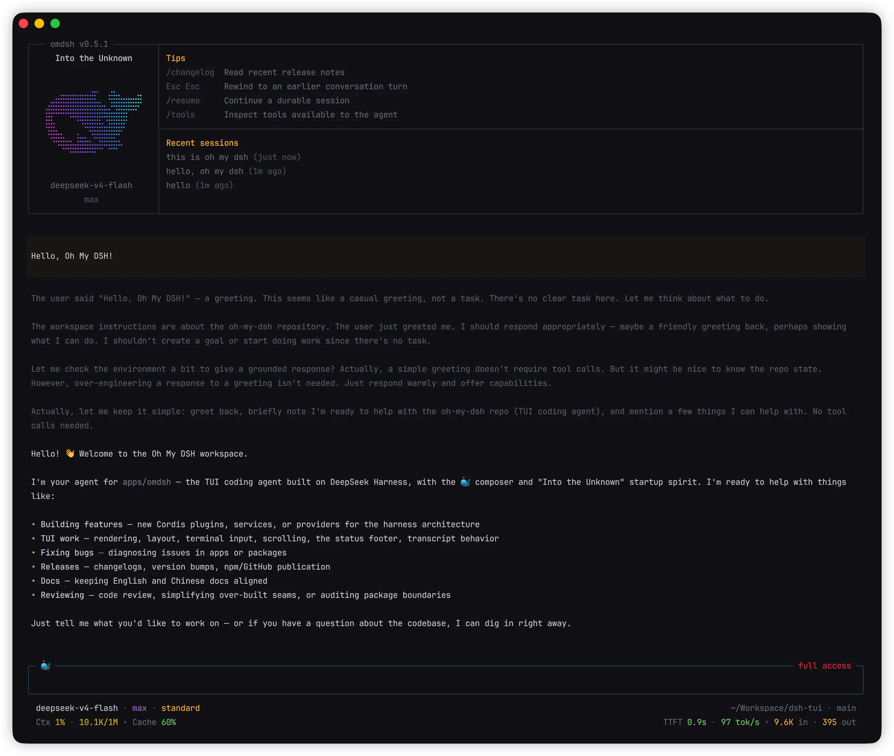

<div align="center">

# oh-my-dsh

**探索未至之境**

一个专注、键盘优先的 DeepSeek Coding Agent，构建于 [DeepSeek Harness](https://github.com/deepseek-ai/deepseek-harness) 插件架构之上，并受到 [oh-my-pi](https://github.com/can1357/oh-my-pi) 出色交互体验以及最初的 [Pi](https://github.com/earendil-works/pi) Agent Harness 的启发。

[](https://github.com/vanducng/oh-my-dsh/actions/workflows/ci.yml) [](https://www.npmjs.com/package/@vanducng/oh-my-dsh) [](https://www.npmjs.com/package/@vanducng/oh-my-dsh) [](https://nodejs.org/) [](LICENSE)

[English](README.md) · 简体中文

</div>



## 快速开始

运行环境需要 Node.js 22.19 或更高的 22.x 版本，或者 Node.js 24 及更高版本；进行真实模型对话时还需要 DeepSeek API Key。

```sh
npm install --global @vanducng/oh-my-dsh
omdsh
```

进入 omdsh 后运行一次 `/login`，验证并保存 DeepSeek API Key，即可开始对话。如果不想全局安装，可以运行 `npx @vanducng/oh-my-dsh` 临时体验。

## 功能亮点

- **持久化对话：** 支持恢复会话、回退到指定用户轮次、重试、压缩，并将完整对话导出为 Markdown。
- **四项真实会话控制：** 选择 Harness Agent preset（Standard、PTC、Minimal 或 Cordis）、Workflow（Default 或 Plan）、工具展示（Native、Code 或 Both）和 Access（Read only、Workspace write 或 Full access）。
- **丰富的终端输入：** 使用 `@` 提及项目文件和其他会话，粘贴剪贴板图片，复用持久输入历史，通过外部编辑器处理多行 Prompt，并取回排队中的后续消息。
- **清晰的工具活动：** 跟踪流式工具调用和子智能体的实时进展，在空 composer 中按 `↓` 再按 `Enter`（或直接按 `Alt+A`）进入键盘驱动的 Agent Hub 并选择子智能体，从其对话里直接跟进可续写任务，查看独立的 Input 和 Output 分区，展开长输出，并让工具插件继续拥有领域展示语义。
- **实时运行上下文：** 无需离开 Composer，即可查看 Agent、Workflow、Tools、Access、模型、推理强度、工作区、Git 状态、上下文压力、Token、TTFT、吞吐率、缓存、耗时、轮次和步骤。
- **为响应速度而设计：** 复用已完成的 Transcript 布局、合并滚动更新、只输出发生变化的终端行，并正确处理 CJK 文本和 emoji 的显示宽度。

## 学习指南

- [教程](docs/tutorials.zh-CN.md) — 完成第一个任务、提供精确上下文、引导队列任务、恢复长会话、定制工作环境，并编写可安装插件。
- [Skills 与 MCP](docs/skills-and-mcp.zh-CN.md) — 使用可复用指令和外部工具扩展项目。
- [用户插件](docs/plugins.zh-CN.md) — 用 `omdsh plugin` 把 DSH bundle 装进 omdsh Profile。
- [架构](docs/architecture.zh-CN.md) — 了解插件边界与运行时数据流。
- [性能](docs/performance.zh-CN.md) — 查看 Benchmark、测试方法与渲染优化。

## 为什么做 oh-my-dsh

DeepSeek Harness 提供了能力完整的 Agent Runtime，也带来了一条很重要的架构原则：一切皆插件。oh-my-dsh 将这套运行时带入安静、键盘驱动的终端体验，同时不创造第二套 Agent Core，也不使用平行抽象将 Harness 隐藏起来。

TUI 始终只是表现层与交互层。会话、工具、权限、模型、Skills、MCP Server、命令和遥测数据来自 Harness Service 与插件；omdsh 负责将它们组合为终端应用，并补充舒适使用这些能力所需的界面行为。

项目遵循四项原则：

- **原生融入 Harness：** 使用正式发布的 DeepSeek Harness 软件包，并将其作为 Agent 行为、状态与生命周期的事实来源。
- **建立真实插件边界：** 为拥有独立生命周期和贡献点的能力建立插件，而不是把每个源文件都变成插件。
- **终端只有一个所有者：** 将 raw input、光标状态、viewport 管理和原子化渲染保留在本地 TUI Provider 中。
- **渐进式呈现：** 默认界面保持简洁，同时让工具、遥测、设置及会话详情可以按需发现。

`refs/` 下的参考项目始终是只读研究材料。运行时代码只依赖已发布软件包和 oh-my-dsh 自身的 workspace 软件包。

## 架构

```text
DeepSeek Harness 插件与服务
             │
             ▼
 @vanducng/dsh-tui — 终端能力边界
             │
             ▼
 @vanducng/oh-my-dsh — 启动与插件组合
```

TUI 软件包拆分为 Service Definition、本地终端 Provider、会话与交互适配器、工具展示适配桥、命令贡献插件和交互式 Runner。这让终端所有权与 Harness 领域状态相互隔离，也只在能力拥有独立生命周期或所有者时公开插件边界。当前边界与数据流请参阅[架构概览](docs/architecture.zh-CN.md)。

## 性能

性能是 TUI 架构本身的一部分：持久化会话按线性时间回放，Harness Projection 避免重复扫描历史，已完成的 Transcript 区块会保留格式化布局，终端写入器则只输出发生变化的行。在报告所用的 Apple M5 Pro 环境中，恢复 10,000 轮对话的中位耗时为 2.15 ms，恢复 10,000 次工具调用为 21.21 ms，在 5,000 轮对话界面上进行缓存更新的平均耗时为每帧 0.24 ms。

完整方法与限制请参阅可复现的 [TUI 性能报告](docs/performance.zh-CN.md)，也可以在本地运行 `pnpm benchmark:tui`。

## 配置

运行 `/login` 可以配置一家提供方的 API Key。DeepSeek 仍会打开官方 Key 管理页、验证 Key，并让这份存储凭据优先于继承的 `DEEPSEEK_API_KEY`。同一条命令也可以激活 OpenAI、Anthropic 等 catalog 提供方，或添加自定义提供方（自己的 id、Base URL、协议和模型 id）。之后 `/model` 会列出所有已激活的路由。`/logout` 会删除由 omdsh 管理的选择；对 DeepSeek 而言，环境变量可用时会回退到环境变量。

模型配置也可以来自 `$DSH_HOME/settings.yaml`。Skills 与 MCP 的配置方式请参阅 [Skills 与 MCP](docs/skills-and-mcp.zh-CN.md)。

升级后，omdsh 可以在启动时只展示一次版本说明。使用 `/changelog` 查看近期条目，或使用 `/changelog full` 查看随包发布的完整历史。程序每天至多执行一次带缓存的 npm 版本检查，只提示新版本而不会自动安装；这两项行为都可以在 `/settings` 中调整。

## 开发

```sh
pnpm install
pnpm omdsh "list files"  # 从源码运行
pnpm typecheck           # 检查 TypeScript
pnpm test                # 单元测试与管道模式测试
pnpm build               # 构建全部 workspace 软件包
pnpm smoke               # 交互式 PTY 冒烟测试
pnpm smoke:happy         # 使用模拟 LLM 验证正常流程
pnpm smoke:tui           # 80x30 VT 网格冒烟测试（模拟 LLM，外加一份经过脱敏的 vanducng/dotfiles dsh 启动）
```

`refs/deepseek-harness`、`refs/oh-my-pi` 与 `refs/pi` 中的代码是只读参考项目。开发 omdsh 时不要将它们用作运行时依赖，也不要修改其内容。

## 变更日志

面向用户的变更与版本发布记录统一维护在 [CHANGELOG.md](CHANGELOG.md) 中。

## 致谢

oh-my-dsh 的诞生离不开这些项目：

- [DeepSeek Harness](https://github.com/deepseek-ai/deepseek-harness) 提供了运行时基础、插件架构，以及 Agent 能力应当通过组合而非内嵌于单一应用中的设计信念。
- [Pi](https://github.com/earendil-works/pi) 是最初的开放式 Agent Harness，其终端交互、差分渲染和紧凑的 Coding Agent 工艺，至今仍是这个社区继续建设的基准。
- [oh-my-pi](https://github.com/can1357/oh-my-pi) 延续了这条脉络，并展示了细致的终端交互、紧凑的信息设计和精心设计的键盘工作流，如何让 Agent 既快速又易于使用。

感谢这些项目及其所有贡献者。omdsh 是一个独立的社区项目：它构建于 DeepSeek Harness 之上，并从 Pi 与 OMP 学习，但不是其中任何一个项目的官方发行版本。

## 许可证

oh-my-dsh 使用 [MIT License](LICENSE) 发布。
